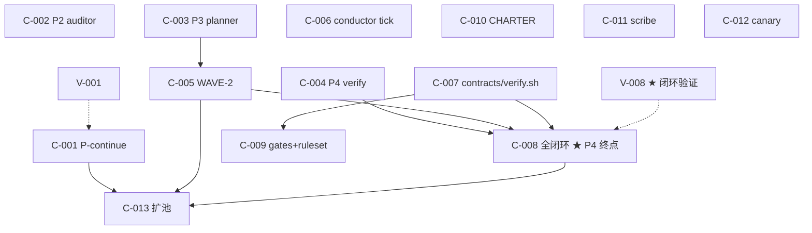

# INDEX.md — 卡片总览与依赖图

> 任何 AI 来这里找活。`ready:true & status:pending` 的卡可领。详见 [README.md](./README.md) 入口判定。

## 卡片总览

### 工作卡 C-0NN

| ID | 标题 | tier | depends_on | ready | status | 优先级 |
|---|---|---|---|---|---|---|
| [C-001](./C-001.md) | 定"继续"路线 + 起草 P-continue.md 提示词 | critical | — | true | **done** | P0 |
| [C-002](./C-002.md) | 补 P2.md（auditor 提示词） | standard | — | true | **done** | P0 |
| [C-003](./C-003.md) | 补 P3.md（planner 提示词） | standard | — | true | **done** | P0 |
| [C-004](./C-004.md) | 补 P4.md（verify 提示词，盲一半协议） | standard | — | true | **done** | P0 |
| [C-005](./C-005.md) | 塞测试 wave WAVE-2 进 product-x | standard | [C-003] | true | **done** | P0 |
| [C-006](./C-006.md) | 把 conductor tick 跑起来 | critical | — | true | **done** | P0 |
| [C-007](./C-007.md) | product-x 立最小 contracts/ + verify.sh | standard | — | true | **done** | P1 |
| [C-008](./C-008.md) | 造 verify.required=true 卡跑通 impl→verify→merge 闭环 | critical | [C-004, C-005, C-007] | **true** | **done** | P1 |
| [C-009](./C-009.md) | 8 个 gate 接进 product-x branch ruleset | standard | [C-007] | **true** | **done** | P1 |
| [C-010](./C-010.md) | 起草 CHARTER.md（G/N/Q） | standard | — | true | **done** | P2 |
| [C-011](./C-011.md) | 验 scribe（journal 第二 remote + mirror token） | trivial | — | true | **done** | P2 |
| [C-012](./C-012.md) | 验 canary（合成工单 + 告警） | trivial | — | true | pending | P2 |
| [C-013](./C-013.md) | 扩到 2-3 沙盒验并发（CAS+租约+reaper） | standard | [C-001, C-005, C-008] | **true** | pending | P2 |
| [C-014](./C-014.md) | 修复 F-001：/health 改用 stdlib（零外部依赖） | standard | [F-001] | true | **done** | P1 |
| [C-015](./C-015.md) | 修复 F-002：product-x ci.yml 加 merge_group 触发器 | critical | [F-002] | true | **done** | P1 |

### 验证卡 V-0NN

| ID | 标题 | verify_target | tier | depends_on | ready | status |
|---|---|---|---|---|---|---|
| [V-001](./V-001.md) | 干净沙盒跑"继续"端到端 | C-001 | critical | [C-001] | true | pending |
| [V-002](./V-002.md) | auditor 跑一次产 Finding | C-002 | standard | [C-002] | true | pending |
| [V-003](./V-003.md) | planner 跑一次产 Wave PR | C-003 | standard | [C-003] | true | pending |
| [V-004](./V-004.md) | verify 跑一次产 VERDICT | C-004 | standard | [C-004] | true | pending |
| [V-005](./V-005.md) | materializer 物化 WAVE-2 过四校验 | C-005 | standard | [C-005] | true | pending |
| [V-006](./V-006.md) | tick 回收僵尸 + 依赖放行 | C-006 | critical | [C-006] | true | pending |
| [V-007](./V-007.md) | verify.required=true 卡调 verify.sh 非退化态 | C-007 | standard | [C-007] | true | pending |
| [V-008](./V-008.md) | impl→verify→VERDICT→merge 全闭环 | C-008 | critical | [C-008] | true | **done** |
| [V-009](./V-009.md) | 不带 gate 的 PR 被 ruleset 拦下 | C-009 | standard | [C-009] | false | **done** |
| [V-010](./V-010.md) | auditor/planner 按 G/N/Q 过滤 | C-010 | standard | [C-010] | true | pending |
| [V-011](./V-011.md) | journal 推第二 remote 成功 | C-011 | trivial | [C-011] | true | pending |
| [V-012](./V-012.md) | canary 合成工单被检测告警 | C-012 | trivial | [C-012] | false | pending |
| [V-013](./V-013.md) | 两沙盒并发 CAS+租约+reaper 不出错 | C-013 | standard | [C-013] | false | pending |

### Finding 卡 F-0NN（验证 FAIL 时动态新建，初始为空）

| ID | 关联 | 复现次数 | 复现成功 | 复现失败 | status |
|---|---|---|---|---|---|
| [F-001](./F-001.md) | W2-002 / C-008 / V-008 | 1 | 1 | 0 | done |
| [F-002](./F-002.md) | C-009 / C-014 / V-008 | 1 | 1 | 0 | **done** |

## 依赖图（mermaid）

## 可立即并行启动的卡（ready:true & status:pending & 无依赖）

**第一批可同时开干（无前置依赖）**：
- C-001（P-continue，critical）
- C-002（P2 auditor）
- C-003（P3 planner）
- C-004（P4 verify）
- C-006（conductor tick，critical）
- C-007（contracts）
- C-010（CHARTER）
- C-011（scribe）
- C-012（canary）

这 9 张可由 9 个并行 AI 沙盒同时领。**建议先打 critical 两张**：C-001、C-006。
